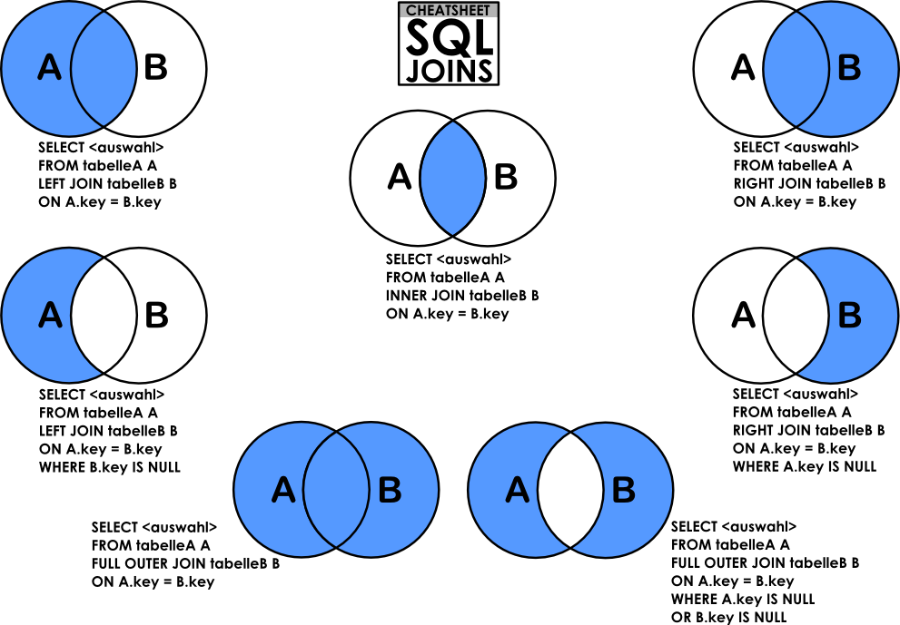
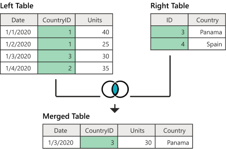
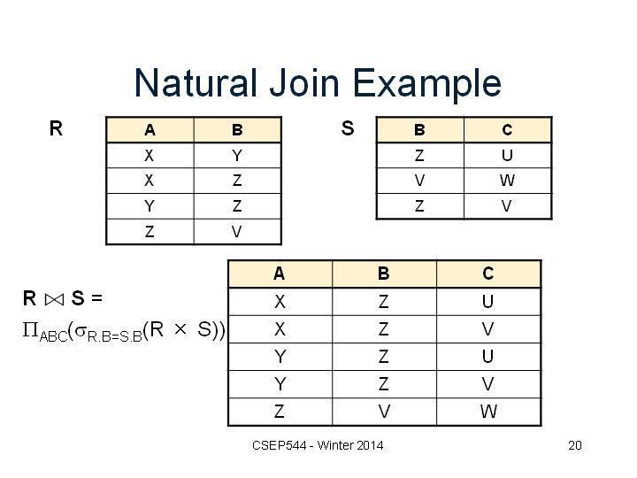
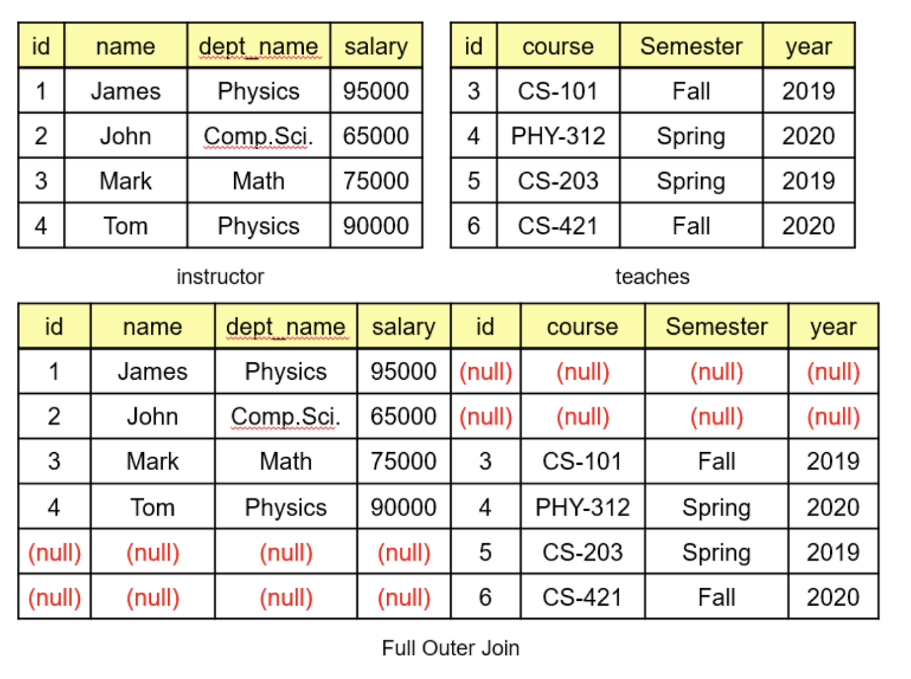
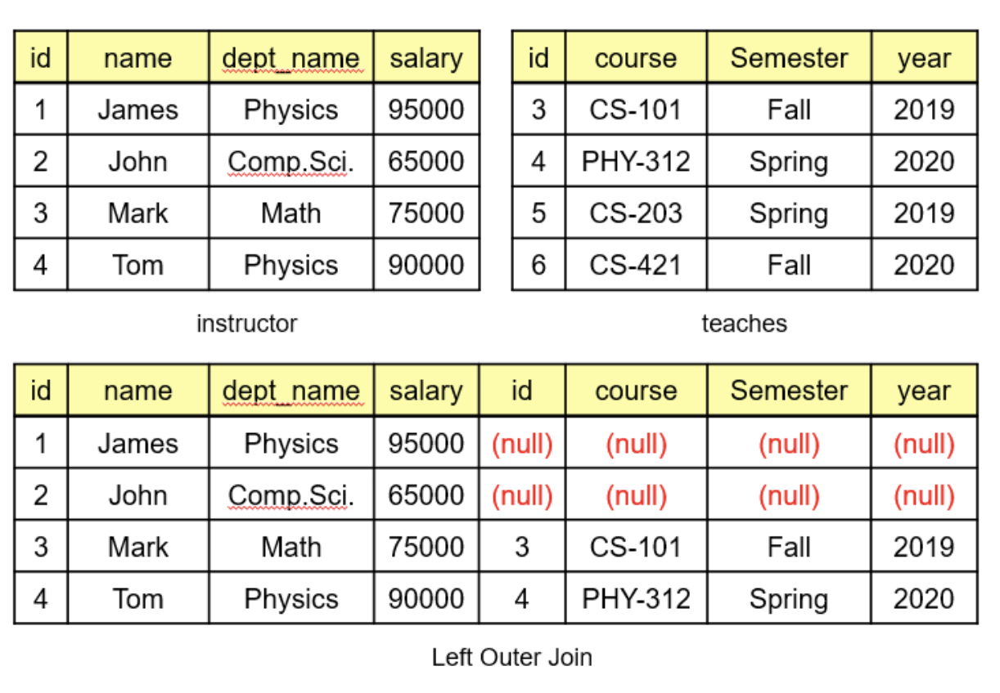
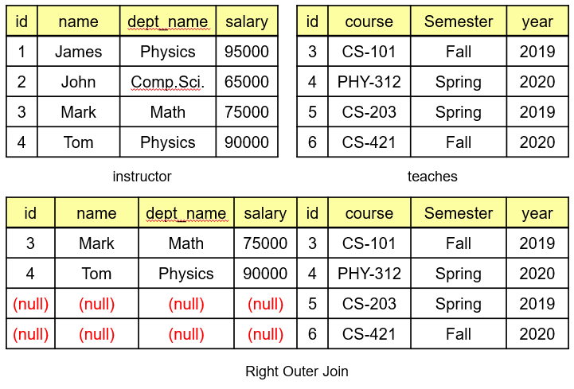
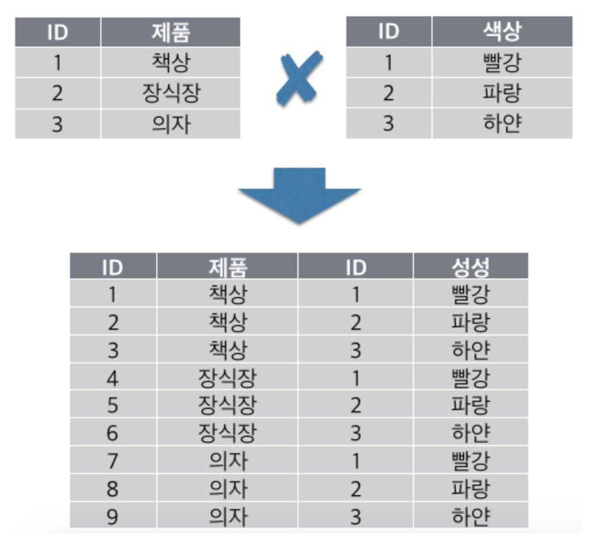

# JOIN 개념 정리
#

## 1. JOIN이란?
두 개 이상의 테이블을 서로 연결하여 데이터를 조회할 때 사용하는 방법  
두 개의 테이블을 마치 하나의 테이블처럼 보여준다.

## 2. 기본구조
```
SELECT 테이블.컬럼, 테이블.컬럼
FROM 테이블1, 테이블2
WHERE 조건
```

## 3. JOIN의 종류
- INNER JOIN
- NATURAL JOIN
- OUTER JOIN
- CROSS JOIN


</img>

### 3-1. 내부조인(INNER JOIN)
- 기준 테이블과 조인 테이블 모두에 조인 컬럼 데이터가 존재해야 조회됨 (ON절)
- 예시
```
SELECT Sales.*, Countries.Country
FROM Sales
JOIN Countries
ON Sales.CountryID = Countries.ID
```
</img>

### 3-2. 자연조인(NATURAL JOIN)
- 내부 조인에 속함
- 두 테이블에서 동일한 컬럼명을 갖는 컬럼을 모두 조인
- 두 테이블이 동일하게 가지고 있는 컬럼의 값이 같은 데이터만 조회
  - 두 테이블 컬럼의 같은 이름, 타입을 가진 컬럼이 필요
- 기준 테이블과 조인 테이블 모두 데이터가 존재해야 조회 가능
- 예시  
</img>

### 3-3. 외부 조인(OUTER JOIN)
- 공통된 부분만 골라 결합하는 Inner Join과 다르게 공통되지 않은 데이터도 유지한다.
- OUTER JOIN의 종류
  - FULL OUTER JOIN : 두 테이블 모두의 값을 유지
  - LEFT OUTER JOIN : 왼쪽 테이블의 값만 유지
  - RIGTH OUTER JOIN : 오른쪽 테이블의 값만 유지
- MySQL에서는 FULL OUTER JOIN을 지원하지 않으므로 LEFT OUTER JOIN과 RIGHT OUTER JOIN 결과를 UNION 하여 사용함
- 예시
  - FULL OUTER JOIN
  - 
  ```
    SELECT *
    FROM instructor
    FULL OUTER JOIN teaches 
    ON instructor.id = teaches.id
  ```
  </img>
  
  - LEFT OUTER JOIN
  ```
    SELECT *
    FROM instructor
    LEFT OUTER JOIN teaches 
    ON instructor.id = teaches.id  
  ```
  </img>
  - RIGTH OUTER JOIN
  ```
    SELECT *
    FROM instructor
    RIGHT OUTER JOIN teaches 
    ON instructor.id = teaches.id  
  ```
  </img>


### 3-4. 크로스 조인(CROSS JOIN)
- 곱집합
- 두 테이블 데이터의 모든 조합
- 테이블 1의 row * 테이블2의 row 개수만큼의 row를 가진 테이블 생성
</img>
