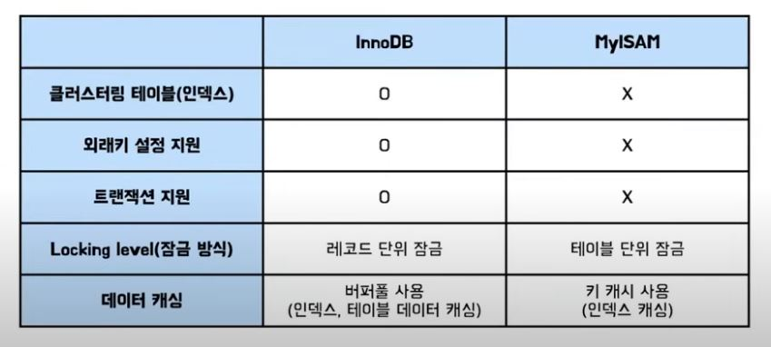

# MySQL 아키텍처 정리
https://youtu.be/vQFGBZemJLQ
#

## MySQL 아키텍처
</img>

### MySQL 접속 클라이언트
- MySQL Connectors(Application)
  - .NET, ODBC, JDBC, Node.js, Python, C++, PHP, Perl, Ruby, etc
- MySQL Shell(Scripting)  

### MySQL 엔진
- NoSQL
  - Interface, CRUD, Operations
- SQL Interface
  - DML, DDL, Stored Procedures, Views, Triggers, etc
- Parser
  - Query Translation, Object Privilege
- Optimizer
  - Query Access Paths, Statistics
- Caches & Buffers
  - Global and Storage Engine Caches & Buffers

### MySQL 스토리지 엔진
- Memory, Index, Relational and Document Storage Management

> InnoDB  
> MyISAM  
> NDB Cluster  
> Memory  
> etc 

### 운영체제, 하드웨어
- File System
- Files & Logs
  - Data, Index, Redo, Undo, Binary, Error, General Query, Slow Query, DDL

#
## 쿼리 실행 과정
</img>

### 쿼리 캐시 (Query Cache)
- SQL 실행 겨과를 메모리에 캐싱하는 역할
- 동일 SQL 실행 시, 이전 결과를 즉시 반환
- 테이블의 데이터가 변경되면 캐싱된 데이터 삭제 필요 (동시 처리 성능 저하)
- MySQL 8.0부터 완전히 제거됨

### 쿼리 파서 (Parser)
- SQL 문장을 토큰으로 쪼개서 트리로 만듦
- 이 과정에서 쿼리 문장의 기본 문법 오류를 체크

### 전처리기 (Preprocessor)
- Parse tree를 기반으로 SQL의 문장 구조를 체크
- Parse tree의 토큰이 유효한지 체크
- 토큰에 해당하는 테이블 이름이나 컬럼이 존재하는지 체크
- 접근 권한 체크

### 옵티마이저 (Optimizer)
- SQL 실행을 최적화해서 실행 계획을 수립
- 규칙 기반 최적화  
  옵티마이저에 내장된 우선순위에 따라 실행 계획 수립
- 비용 기반 최적화  
  작업의 비용과 대상 테이블의 통계 정보를 활용해서 실행 계획 수립

### 쿼리 실행 엔진 (Query Execution Engine)
- 옵티마이저가 만든 실행 계획대로 스토리지 엔진을 호출하여 쿼리를 수행

### 스토리지 엔진 (Storage Engines)
- 쿼리 실행 엔진이 요청하는대로 데이터를 디스크로 저장하고 읽음
- 핸들러 API에 의해 동작
- 핸들러라고도 불림
- 플러그인 형태로 제공

#
## InnoDB 스토리지 엔진 아키텍처
</img>

### InnoDB의 핵심 특징
- 프라이머리 키에 의한 클러스터링
- 트랜잭션 지원  
  (MVCC, Redo 로그 & Undo 로그, 레코드 단위 잠금)
- InnoDB 버퍼풀 & 어댑티브 해시 인덱스

### PK에 의한 클러스터링
- 레코드를 PK순으로 정렬해서 저장
- PK를 통해서만 레코드에 접근 가능
- PK를 통한 범위 검색이 매우 빠름
- But 클러스트링 떄문에 쓰기 성능 저하(읽기에 유리)

### 트랜잭션 - MVCC(Multi Version Concurrency Control)
</img>
- InnoDB 버퍼풀 : 변경된 데이터를 디스크에 반영하기 전까지 버퍼링 하는 공간
- Undo 로그 : 변경 되기 이전 데이터를 백업해두는 공간

### 트랜잭션 - Undo 로그와 Redo 로그
</img>

- 하드웨어 또는 소프트웨어 문제로 MySQL 복구가 필요할때는 Redo로그를 이용

### 트랜잭션 - 레코드 단위잠금
- 레코드 단위로 잠금을 걸기 때문에 동시 처리 성능이 좋다
- 사실 레코드 자체를 잠그는 것이 아니라, 인덱스를 잠근다
- 인덱스 단위의 잠금이 이루어지기 때문에, 인덱스 설정 시 복합 인덱스 설정 등으로 잠금 범위를 최소화

### 버퍼풀
- 데이터 캐싱
  - 인덱스 정보와 데이터 파일을 메모리에 캐싱
  - 페이지 단위로 테이블 데이터를 관리
  - 페이지 교체 알고리즘으로 LRU 사용
- 쓰기 지연 버퍼
  - 변경된 데이터를 버퍼풀에 모았다가 한번에 디스크에 기록
  - JPA 영속 컨텍스트의 쓰기 지연 SQL 저장소와 비슷
  - 랜덤 I/O를 줄이기 위해 사용
- 어댑티브 해시 인덱스
  - 페이지에 빠르게 접근하기 위한 해시 자료구조 기반 인덱스
  - <인덱스 키, 페이지 주소 값> 쌍으로 구성됨
  - 자주 요청되는 페이지에 대해 InnoDB가 자동으로 생성하는 인덱스

## MyISAM 스토리지 엔진 아키텍처
### MyISAM의 핵심 특징
- 클러스터링 지원 X
- 트랜잭션 지원 X
- 외래키 지원 X
- 테이블 단위 잠금
- 키 캐시 사용(인덱스 정보만 버퍼링)
- 전문 검색, 공간 좌표 검색 기능 지원

## 스토리지 엔진 비교
</img>