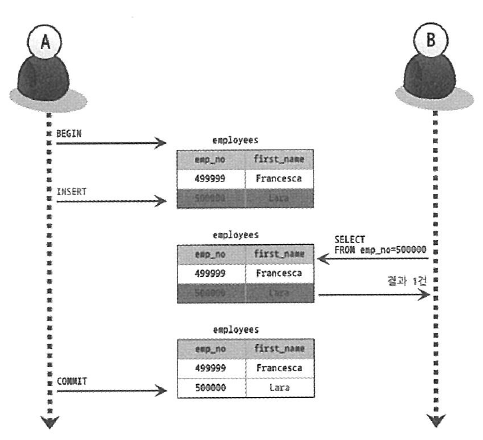
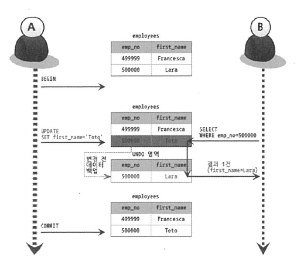
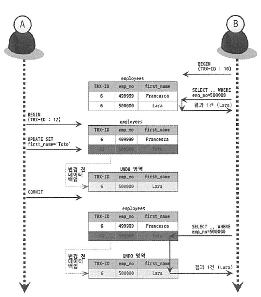
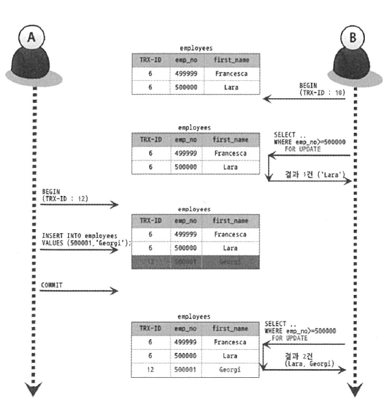

# 트랜잭션 격리수준 (Isolation Level)
트랜잭션에서 일관성이 없는 데이터를 허용하도록 하는 수준을 의미
MySQL의 기본 격리수준은 REPEATABLE-READ  

## MVCC (MultiVersion Concurrency Control)
MVCC는 동시성 제어이다. 동시성 제어는 그 자체로도 매우 깊고 다양화되어 있지만, 트랜잭션 별 데이터 잠금 관점(격리수준 별)에서 크게 4가지로 분류된다
- Read Uncommitted
- Read Committed
- Repeatable Read
- Serializable
위에서 아래로 갈수록 Isolation Level이 높아지며, 성능이 떨어진다.  

- 격리 수준 별 부정합 문제점  

||DIRTY READ|NON-REPEATABLE READ|PHANTOM READ|
|---|:---:|:---:|:---:|
|READ UNCOMMITTED|발생|발생|발생|
|READ COMMITTED|발생하지않음|발생|발생|
|REPEATABLE READ|발생하지않음|발생하지않음|InnoDB는 발생하지않음|
|SERIALIZABLE|발생하지않음|발생하지않음|발생하지않음|

#
### MVCC에 따른 MySQL의 특성
- 읽기를 수행할 경우 갱신 중이라도 블록되지 않는다(읽기와 읽기도 서로 블록되지 않는다)
- 읽기 내용은 격리 수준에 따라 내용이 바뀌는 경우가 있다.
- 갱신 시 배타적 잠금을 얻는다. 잠금은 기본적으로 행 단위로 얻으며, 트랜잭션이 종료할 떄까지 유지한다.  
  InnoDB의 설정에 따라 실제로 잠금하는 행의 범위가 다른 경우가 있다.
- 갱신과 갱신은 늦게온 트랜잭션이 잠금을 획득하려고 할때 블록된다. 일정 시간을 기다리며 그 사이에 잠금을 획득할 수 없는 경우에는 '잠금 타임아웃(Lock Timeout)'이 된다.
- 갱신하는 경우 갱신 전의 데이터를 UNDO로그로 '롤백 세그먼트'라는 영역에 유지한다. 이 'UNDO 로그'는 용도가 2가지인데, 첫번째는 갱신하는 트랜잭션의 롤백 시 갱신 전으로 되돌리는 것이고, 두번째는 복수의 트랜잭션으로부터 격리 수준에 따라 대응하는 갱신 데이터를 참조하는데 이용한다.

### 1. Read Uncommitted
- 트랜잭션의 변경 내용이 COMMIT이나 ROLLBACK에 상관없이 다른 트랜잭션에서 조회된다.
- 예시
</img>

### 2. Read Committed
- 오라클에서 기본적으로 사용되는 격리수준이며, 온라인 서비스에서 가장 많이 선택되는 격리수준  
- Dirty Read는 발생하지 않으나 부정합 문제가 발생할 수 있다.
- 트랜잭션에서 데이터를 변경했더라도 COMMIT이 완료된 데이터만 다른 트랜잭션에서 조회가 가능하다.  
- 예시  
</img>

>위의 그림에서 사용자 A는 emp_no=500000인 사원의 first_name을 "Lara"에서 "Toto"로 변경했는데, 이때 새로운 값인 "Toto"는 employees 테이블에 즉시 기록되고 이전 값인 "Lara"는 언두 영역으로 백업된다. 사용자 A가 커밋을 수행하기 전에 사용자 B가 emp_no=500000인 사원을 SELECT하면 조회된 결과의 first_name 칼럼의 값은 "Toto"가 아니라 "Lara"로 조회된다. 여기서 사용자 B의 SELECT 쿼리 결과는 employees 테이블이 아니라 언두 영역에 백업된 레코드에서 가져온 것이다. READ COMMITTED 격리 수준에서는 어떤 트랜잭션에서 변경한 내용이 커밋되기 전까지는 다른 트랜잭션에서 그러한 변경 내역을 조회할 수 없기 때문이다. 최종적으로 사용자 A가 변경된 내용을 커밋하면 그때부터는 다른 트랜잭션에서도 백업된 언두 레코드("Lara")가 아니라 새롭게 변경된 "Toto"라는 값을 참조할 수 있게 된다.

- 부정합 예시  
</img>
> 아래 그림에서 처음 사용자 B가 BEGIN 명령으로 트랜잭션을 시작하고 first_name이 'Toto%'인 사용자를 검색했는데, 일치하는 결과가 없었다. 하지만 사용자 A가 사원번호 500000인 사원의 이름을 "Toto"로 변경하고 커밋을 실행한 후, 사용자 B는 똑같은 SELECT 쿼리로 다시 조회하면 이번에는 결과가 1건이 조회된다. 이는 별다른 문제가 없어 보이지만, 사실 사용자 B가 하나의 트랜잭션 내에서 똑같은 SELECT 쿼리를 실행했을 때는 항상 같은 결과를 가져와야 한다는 "REPEATABLE READ" 정합성에 어긋나는 것이다.

> 가끔 사용자 중에서 트랜잭션 내에서 실행되는 SELECT 문장과 트랜잭션 없이 실행되는 SELECT 문장의 차이를 혼동하는 경우가 있다. READ COMMITTED 격리 수준에는 트랜잭션 내에서 실행되는 SELECT 문장과 트랜잭션 외부에서 실행되는 SELECT 문장의 차이가 별로 없다. 하지만 REPEATABLE READ 격리 수준에서는 기본적으로 SELECT 쿼리 문장도 트랜잭션 범위 내에서만 작동하는 것이다. 즉, "START TRANSACTION"으로 트랜잭션을 시작한 상태에서 온종일 동일한 쿼리를 반복해서 실행해봐도 동일한 결과를 보게 된다(아무리 다른 트랜잭션에서 그 데이터를 변경하고 COMMIT을 실행한다 하더라도 말이다). 별로 중요하지 않은 차이처럼 보이지만 이런 문제로 데이터의 정합성이 깨지고 그로 인해 애플리케이션의 버그가 발생하면 찾아내기가 쉽지 않다.

### 3. Repeatable Read
- MySQL의 InnoDB 스토리지 엔진의 기본 격리수준
- 트랜잭션이 ROLLBACK될 가능성에 대비해 변경되기 전 레코드를 UNDO공간에 백업해두고 실제 레코드 값을 변경한다.(MVCC)
- Repeatable Read는 MVCC를 위해 UNDO 영역에 백업된 데이터를 이용해 동일 트랜잭션 내에서는 동일한 결과를 보여줄수 있도록 보장한다. 
- 모든 InnoDB 트랜잭션은 고유한 트랜잭션 번호를 가지며, UNDO영역에 백업된 모든 레코드에는 변경을 발생시킨 트랜잭션의 번호가 포함되어 있다. UNDO 영역의 데이터는 InnoDB 엔진이 불필요하다고 판단하는 시점에 주기적으로 삭제한다.
- 예시  
</img>

- Repeatable Read 격리수준에서도 SELECT ... FOR UPDATE 또는 SELECT ... LOCK IN SHARE MODE로 조회되는 레코드는 언두 영역의 변경 전 데이터를 가져오는 것이 아니라 현재 레코드의 값을 가져오게 되어 다른 트랜잭션에서 수행한 변경 작업에 의한 PHANTOM READ 현상이 발생할 수 있다.
-  PHANTOM READ 예시  
</img>

### 4. Serializable
- 가장 단순한 격리수준이지만 엄격한 격리 수준.
- 동시 처리 성능이 다른 격리수준보다 떨어진다.
- 읽기 작업에 대해서도 잠금을 획득하여 동시에 다른 트랜잭션은 레코드에 접근할 수 없게 된다.